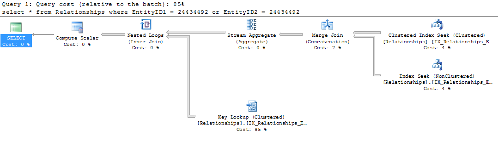
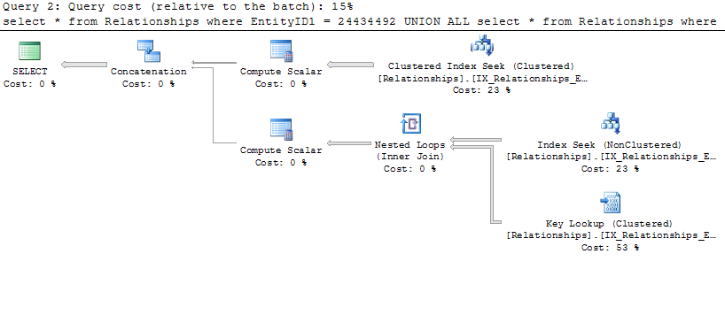

When writing SQL queries, I try to use logic that is intuitive to myself and to someone else who may read my code in the future. While this is good practice, it is equally important to consider the performance of what you write. I often see queries where the author crams as much logic into a single query as possible, presuming a smaller and less complicated query will make for a more efficient query. Sometimes this is true, other times it is the opposite. One case where I've seen this over and over is when using OR statements.

Consider a table that stores the relationships between two entities:


CREATE TABLE Relationships
(
  RelationshipID BIGINT,
  RelationshipTypeID tinyint,
  EntityID1 BIGINT,
  EntityID2 BIGINT
  CONSTRAINT PK_Relationships PRIMARY KEY NONCLUSTERED (RelationshipID)
);
CREATE CLUSTERED INDEX IX_Relationships_EntityID1
  ON Relationships(EntityID1);
CREATE NONCLUSTERED INDEX IX_Relationships_EntityID2
  ON Relationships(EntityID2);


Say we want to get all relationships for a specific EntityID, where it is either EntityID1 or EntityID2. Because we want to get the PK and the type of the relationship, as well as the other entity to which it is associated, we're going to return all columns (this becomes important later).


SELECT * FROM Relationships
WHERE EntityID1 = 24434492
OR EntityID2 = 24434492;


This is concise and clear, and the way most would write the query. It returns the desired results and is intuitive. However, it doesn't run quite as fast as we expect. Looking at the query plan we can see why:

Because we combined both query predicates, we're forced to do a <a href="http://technet.microsoft.com/en-us/library/bb326635(v=sql.105).aspx" target="_blank">Key Lookup</a> on the entire result set. This involves going back and looking up in the clustered index each row that satisfies our query.

This seems redundant, as half of our query already looks at the clustered index on the table.


SELECT * FROM Relationships
WHERE EntityID1 = 24434492
UNION ALL
SELECT * FROM Relationships
WHERE EntityID2 = 24434492;


Splitting the query up allows us to avoid doing the Key Lookup on the entire result set, and just do it on the part that's necessary. Using <a href="http://msdn.microsoft.com/en-us/library/ms184361.aspx" target="_blank">STATISTICS IO</a> I can see that the second query does less than 10% of the reads as the first. While the first query is fewer lines of code, the second is not only more performant, but easier to debug as both cases can be run separately.

While this example greatly benefits from splitting up the logic in OR statements, not all will. If I were just returning the RelationshipID and had it <a href="http://www.dbadiaries.com/sql-server-covering-index-and-key-lookup" target="_blank">covered</a> in the second index, there would be no need for a Key Lookup at all.
