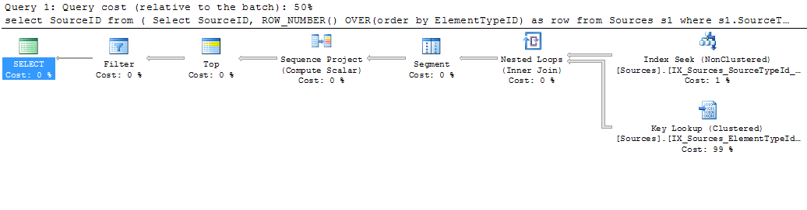
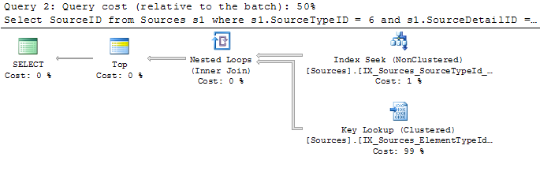

When we started upgrading our SQL Server 2008 instances to 2012, I went back and reviewed the [new development features](http://technet.microsoft.com/en-us/library/09f0096e-ab95-4be0-8c01-f98753255747) that were added. There were many that I was excited to try out and find what performance and readability improvements I would experience. Among those was the pagination enhancements to the [ORDER BY](http://technet.microsoft.com/en-us/library/ms188385) clause which allow you to specify an offset and number of rows you want. MySQL developers have long used the convenient [LIMIT](http://dev.mysql.com/doc/refman/5.0/en/select.html) statement, but SQL Server developers have had to use subqueries or CTEs with ranking functions to achieve the same effect.

Before I start using the new syntax in my queries, I wanted to investigate the performance differences between the two methods. Not only to justify switching over to the new way of doing things, but to see what's happening under the hood.

Consider a table with the following schema and indexes:

```sql
CREATE TABLE Sources
(
  SourceID BIGINT NOT NULL,
  ElementTypeID tinyint NOT NULL,
  ElementID BIGINT NOT NULL,
  SourceTypeID tinyint NOT NULL,
  SourceDetailID BIGINT NOT NULL
  CONSTRAINT PK_Sources PRIMARY KEY NONCLUSTERED (SourceID)
);
CREATE CLUSTERED INDEX IX_Sources_SourceTypeId_SourceDetailId
  ON Sources(SourceTypeID, SourceDetailID);
CREATE NONCLUSTERED INDEX IX_Sources_ElementTypeId_ElementId
  ON Sources(ElementTypeID, ElementID);
```

Because there can be thousands of rows for a given SourceTypeID and SourceDetailID, I'd like to perform some pagination before returning the rows to my app. The usual way I do this is, in a subquery, perform a [ROW_NUMBER()](http://technet.microsoft.com/en-us/library/ms186734.aspx) over the columns by which I want to sort. I then use the page number and the number of rows I want to calculate which rows I want (my implementation returns @numResults + 1 so I can figure out if another page of data exists):

```sql
DECLARE @detailID BIGINT, @page INT, @numResults INT,
  @pageStart INT, @pageEnd INT;
SELECT @detailID = 7665626, @page = 20, @numResults = 50;

SELECT @pageStart = ( (@page - 1) * @numResults) + 1;
SELECT @pageEnd = @pageStart + @numResults;

SELECT SourceID FROM (
  SELECT SourceID,
    ROW_NUMBER() OVER(ORDER BY ElementTypeID) AS ROW
  FROM Sources s1
  WHERE s1.SourceTypeID = 6
  AND s1.SourceDetailID = @detailID
) x
WHERE x.ROW BETWEEN @pageStart AND @pageEnd;
```



The query plan shows the index usage and Key Lookup required to get the data, as well as the logical operations needed to get the desired rows. The [Segment](http://technet.microsoft.com/en-us/library/ms180774(v=sql.105).aspx) and [Sequence Project](http://technet.microsoft.com/en-us/library/ms187041(v=sql.105).aspx) operations work to compute the ranking function ROW_NUMBER() over the specified columns. [Top](http://technet.microsoft.com/en-us/library/ms177432(v=sql.105).aspx) is used here to make sure my range is not negative (it checks @pageStart and @pageEnd for negative values). Finally, [Filter](http://technet.microsoft.com/en-us/library/ms175020(v=sql.105).aspx) does the actual filtering of the "row" column generated by the ROW_NUMBER() function.

Here's the same query, written with he new syntax, returning the exact same rows in the exact same order:

```sql
SELECT SourceID
FROM Sources s1
WHERE s1.SourceTypeID = 6
AND s1.SourceDetailID = @detailID
ORDER BY ElementTypeID
  OFFSET (@pageStart - 1) ROWS
  FETCH NEXT (@numResults + 1) ROWS ONLY;
```



While the operations to the right of the Nested Loops are identical (which makes sense, since they both are filtering and ordering based on the same columns), the second query does only the Top operation to limit the number of rows returned. Running these two queries with [STATISTICS IO](http://msdn.microsoft.com/en-us/library/ms184361.aspx) on, the scan count and logical reads are identical. Increasing @numResults by orders of magnitude also returns identical statistics.

So while the two methods use the same amount of IO resources, they do in fact use different amounts of CPU time. Using [STATISTICS TIME](http://technet.microsoft.com/en-us/library/ms190287.aspx) I wasn't able to measure any significant difference in the CPU time used by either. While I'm sure there is a difference, the cost of doing the underlying query based on my where clause and the columns I'm outputting outweighs any meaningful performance difference between the two queries. Because of this, I am in no rush to go back and cut over my old queries to this new syntax.

A final word: This should only be seen as a discussion on the different syntax of pagination techniques. Queries can greatly benefit from being rewritten to avoid unnecessary Key Lookups. Dave Ballantyne has a [great article](http://sqlblogcasts.com/blogs/sqlandthelike/archive/2012/04/26/offset-without-offset.aspx) on using subqueries and CTEs to minimize Key Lookups while doing pagination.
