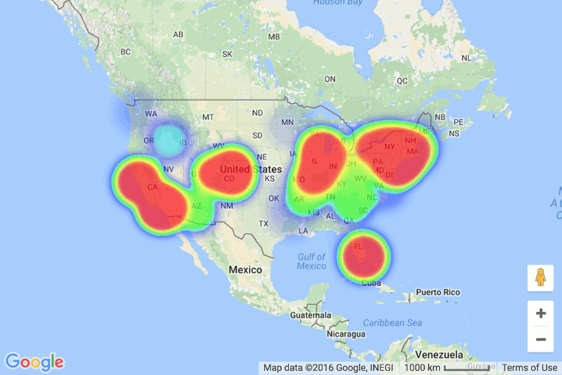
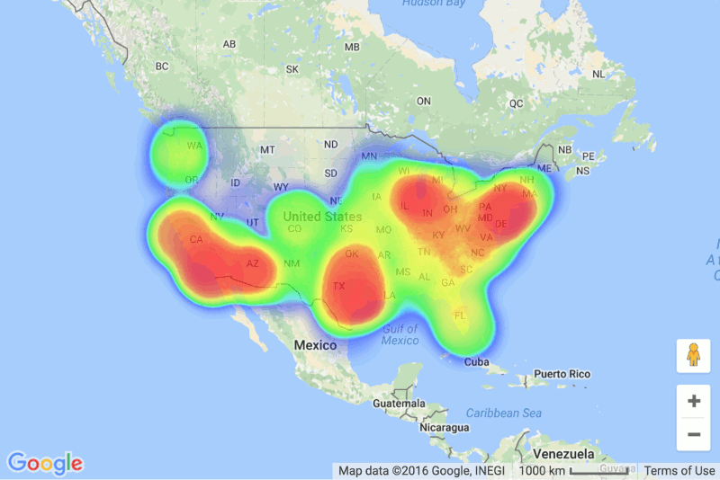

I've been following the <a href="http://arstechnica.com/security/2014/01/greyhats-expose-4-5-million-snapchat-phone-numbers-using-theoretical-hack/" target="_blank">Snapchat data leak</a> pretty closely the past few weeks, from the announced weakness to the actual leak of the phone numbers. What I found most interesting about this in particular was that instead of email addresses, password hashes, or credit cards, the leaked data was geographical, mappable data.

Digging into what actually leaked, I saw some <a href="http://www.reddit.com/r/netsec/comments/1u4xss/snapchat_phone_number_database_leaked_46_million/ceelgxi" target="_blank">analysis</a> that suggests that only a fraction of area codes were represented in the leak. The easiest way to see what regions had the most exposed users is to map the area codes and their respective counts of users. <a href="http://www.patrick-wied.at/static/heatmapjs/example-heatmap-googlemaps.html" target="_blank">Google Maps API and heatmap.js</a> provides an easy way to create such a map.

The main challenge to making the map was associating an area code with a geographical location. Area codes change over time, and aren't associated with a specific location, but rather with several cities, counties, or regions. Searching for a list of area codes and their location, I came across <a href="https://www.allareacodes.com/area-code-list.htm" target="_blank">www.allareacodes.com</a>. With some jQuery DOM parsing, and using <a href="https://developers.google.com/maps/documentation/javascript/geocoding" target="_blank">GMaps Geocoding Service</a>, I was able to get a mapping of area codes to approximate geographical location. The code for this is available on GitHub.

After I joined the coordinates with the number of occurrences the area code had in the SnapchatDB, making the heatmap was a matter of tweaking the heatmap.js options. The main option to consider is "max", which controls the intensity at different counts. If I were to set it to the true max, the lower 20% of area codes or so wouldn't even be visible on the map. The value I chose (50000) is arbitrary and solely due to my preference.

The distribution of leaked phone numbers is pretty interesting. Lots of northeast (NYC, Boston, DC, Philly) and California (LA, SF). However, the map doesn't look so interesting when compared to a similar map of the population (using data from <a href="http://en.wikipedia.org/wiki/List_of_United_States_cities_by_population" target="_blank">Wikipedia</a>).

Both maps closely follow the same distribution, which makes sense. Because I chose arbitrary scales to represent the density in each location it's tough to do in-depth analysis by just looking at the maps, but the data from Snapchat is easily accessible for anyone to dig into.

Interactive version of these maps are available <a href="https://www.nerdshit.net/snapchat-map/" target="_blank">here</a>. All code is available on <a href="https://github.com/sedenardi/snapchat-map" target="_blank">GitHub</a>.
