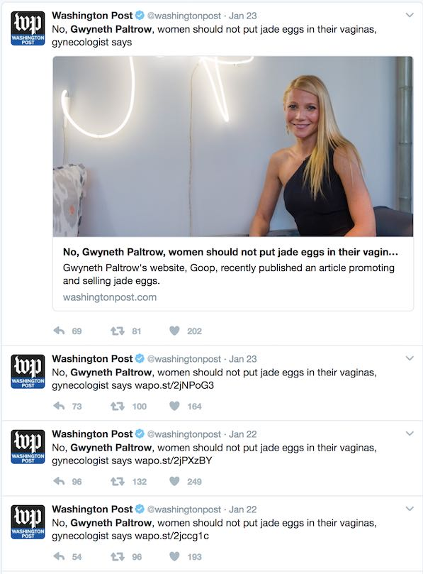

Twitter is a great way to keep abreast of breaking news stories. Reputable news outlets, such as the [The Washington Post](https://twitter.com/washingtonpost) and the [The New York Times](https://twitter.com/nytimes), maintain Twitter feeds that tweet out their stories as they're published. Unfortunately, these feeds can contain a lot of noise in the form of duplicates and undesirable content:

While some may find value in stories like these, it's questionable whether they need to see them show up 4 times within 2 days.

Luckily, most publications still maintain web feeds of their stories using RSS. While most people today probably get their news stories online from Twitter or Facebook, RSS feeds give an unduplicated and standardized list of published items, making them ideal sources for a Twitter feed.

# How It Works

The logic behind our bots is fairly straightforward:

- Fetch all RSS feeds
- De-duplicate, disregard all stories older than 3 hours
- Check to see whether story was already tweeted (whether it exists in the database)
- Tweet out story title and URL
- Record story in database

## Finding RSS Feeds

In the heyday of RSS, news sites used to prominently display links to their feeds on their homepages. Now, they're either relegated to the footer or are completely absent from the visible markup and instead included in the `<meta>` tags of the HTML. Once of the benefits of using RSS feeds for news story sources is that you can customize the feed topics; most sites split up their RSS feeds by category. You can include as many topics as you deem essential to the publication (such as science and politics), and discard any you don't care about (such as those that would include stories mentioned in the beginning of this post).

## De-Duplication

Since we'll potentially be using multiple URLs per publication, we'll have to de-duplicate the stories somehow. RSS feeds usually use the story's URL as the `<guid>`, so we can use that to remove any stories that may overlap among the different feeds. Since we'll want to only tweet out timely stories, we can disregard any stories that are older than a certain threshold (3 hours in this case).

## Keeping Track of Tweets

To keep track of which stories we've tweeted out, we'll need to store the URLs of the stories we encounter to check against the incoming stories. If an incoming story exists in our database, we know to not tweet it out. Since we're only storing and checking against string URLs, our database will essentially act as a hash table.

A simple SQL database would suffice, but needs to persist outside of the main program (especially when run on ephemeral infrastructure such as AWS Lambda). Initial versions used a SQLite database that saved to S3 at the end of the run, but encountered a problem where the database wouldn't be saved if the program timed out. This will occasionally happen, as the program is dependent on both publications' sites generating the feed and on tweeting the stories without getting throttled by Twitter.

The bots now use a simple DynamoDB table with the primary partition key on the Url field. Unlike most SQL databases, DynamoDB is not fully consistent by default. Reads in DynamoDB are usually consistent after a second or two (according to the docs), but the API allows strongly consistent reads with an optional field during the query. This is necessary if the frequency at which our program runs is higher than the time it takes for DynamoDB to achieve consistency across all regions.

## Parsing and Tweeting

The format of tweets largely follows what the publications' official Twitter feeds use: "[Story Title] [URL]". Both fields exist in every publication's feed, but some feeds also include images. We can extract the images from either the `<content>` or `<description>` fields, or (in the case of Atom feeds) in the `<media:content>` field. Tweeting with media is a 3-step process: download the image from the publication, upload the image to Twitter and get the `media_ids`, and tweet the status string with the `media_ids` attached. An example of an RSS feed with images is [The Verge](http://www.theverge.com/rss/index.xml).

# Conclusion and Implications

Integrating RSS feeds into your Twitter feed is just another way to customize the news stories you see. While I personally happen to enjoy a de-cluttered feed, you lose any editorializing by whoever runs the social media account, as well as any timely reposting of articles (which happens if a news story becomes relevant after a long time). Taking the human commentary out of posts in your social media feed may seem to go against the spirit of a social network, but so far I am really enjoying a Twitter feed without inessential, duplicated news stories.

All code can be found [here](https://github.com/sedenardi/rss-tweet). These feeds are active, tweet at [@srednass](https://twitter.com/srednass) or add an issue to the GitHub project to suggest a new publication's feed.

- [@wapo_once](https://twitter.com/wapo_once) - The Washington Post
- [@wsj_once](https://twitter.com/wsj_once) - Wall Street Journal
- [@theverge_once](https://twitter.com/theverge_once) - The Verge
- [@ars_once](https://twitter.com/ars_once) - Ars Technica
- [@nytimes_once](https://twitter.com/nytimes_once) - The New York Times
- [@economist_once](https://twitter.com/economist_once) - The Economist
