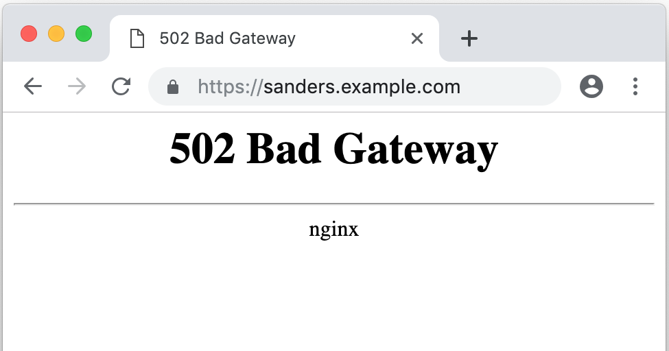

SSH tunnels are used to expose your local development machine to the internet. They're commonly used in web development for:

- demoing websites before deploying to a test or production server
- testing websites on mobile devices
- developing APIs for mobile apps
- building webhook integrations with 3rd parties

They work by establishing a secure connection (an SSH tunnel) between your machine and a publicly accessible machine, which then forwards any requests meant for your machine to you. There are several services that provide this functionality, such as <a href="https://ngrok.com/" target="_blank">ngrok</a> and <a href="https://serveo.net/#intro" target="_blank">Serveo</a>, but you may wish to set up your own for any variety of reasons (price, security).

This guide will describe:

- Configuring nginx and SSL certificates on the remote machine
- Configuring your domain's DNS to point specified domains to the remote machine
- Establishing the SSH tunnel on your local machine

## Remote Machine

In this post I use an AWS EC2 instance as the publically accessible machine, any cloud or traditional hosting provider will work. We'll use 
<a href="https://www.nginx.com/" target="_blank">nginx</a> as our web server to perform the routing and SSL termination. Once you've installed nginx and verified that it's publicly accessible (via Security Groups, firewall configuration, or equivalent), it's time to edit the nginx configuration files.

We'll create two files in the `conf/` subdirectory where nginx is installed. The first, we'll call `http.conf`, simply redirects any http requests to the equivalent https address.

```
server {
    listen       80;
    rewrite      ^ https://$host$request_uri? permanent;
}
```

Next, we'll create `https.conf` which handles the actual proxying of incoming requests to your local machine.

```
map $http_host $port {
    hostnames;

    sanders.example.com      3001;
    sanders2.example.com     3002;
    sanders3.example.com     3003;
}

server {
    listen       443 ssl;
    ssl on;
    ssl_certificate /etc/letsencrypt/live/example.com/fullchain.pem;
    ssl_certificate_key /etc/letsencrypt/live/example.com/privkey.pem;

    ssl_session_cache    shared:SSL:1m;
    ssl_session_timeout  5m;

    #ssl_protocols  SSLv2 SSLv3 TLSv1;
    #ssl_ciphers  HIGH:!aNULL:!MD5;
    #ssl_prefer_server_ciphers  on;

    add_header Strict-Transport-Security "max-age=63072000; includeSubdomains; ";
    add_header X-Frame-Options "DENY";

    location / {
        proxy_pass http://127.0.0.1:$port;
        proxy_http_version 1.1;
        proxy_set_header Upgrade $http_upgrade;
        proxy_set_header Connection 'upgrade';
        proxy_set_header Host $host;
        proxy_set_header X-Real-IP $remote_addr;
        proxy_set_header X-Forwarded-For $proxy_add_x_forwarded_for;
        proxy_cache_bypass $http_upgrade;
    }
}
```

Let's go through this file to see what it does.

```
map $http_host $port {
    hostnames;

    sanders.example.com      3001;
    sanders2.example.com     3002;
    sanders3.example.com     3003;
}
```

This <a href="http://nginx.org/en/docs/http/ngx_http_map_module.html" target="_blank">`map`</a> block creates a new variable `$port` that's dependent on the value of the incoming `$http_host` hostname. So, whenever the server receives a request meant for `sanders2.example.com`, it sets the value of `$port` to `3002`, which is used in the next block.

```
server {
    listen       443 ssl;
    ssl on;
    ssl_certificate /etc/letsencrypt/live/example.com/fullchain.pem;
    ssl_certificate_key /etc/letsencrypt/live/example.com/privkey.pem;

    ssl_session_cache    shared:SSL:1m;
    ssl_session_timeout  5m;

    #ssl_protocols  SSLv2 SSLv3 TLSv1;
    #ssl_ciphers  HIGH:!aNULL:!MD5;
    #ssl_prefer_server_ciphers  on;

    add_header Strict-Transport-Security "max-age=63072000; includeSubdomains; ";
    add_header X-Frame-Options "DENY";

    location / {
        proxy_pass http://127.0.0.1:$port;
        proxy_http_version 1.1;
        proxy_set_header Upgrade $http_upgrade;
        proxy_set_header Connection 'upgrade';
        proxy_set_header Host $host;
        proxy_set_header X-Real-IP $remote_addr;
        proxy_set_header X-Forwarded-For $proxy_add_x_forwarded_for;
        proxy_cache_bypass $http_upgrade;
    }
}
```

Here we're telling nginx to listen for requests on the https 443 port and use Let's Encrypt certificates (details below) for SSL. The `location /` block forwards the request to `http://127.0.0.1:$port`. This is the remote machine's localhost address, and the `$port` variable is mapped depending on the request's hostname using the previous `map` block. The other lines deal with SSL termination configuration and forwarded proxy headers, and can be customized based on your needs.

Remember to restart nginx after saving any configuration files or SSL certificates.

#### A Note on SSL Certificates

For SSL certificates I use <a href="https://letsencrypt.org/" target="_blank">Let's Encrypt</a>, as they're free and allow you to programmatically renew the certs. As of May 2018, Let's Encrypt supports creating wildcard certificates. Before, you could create a single certificate that covered multiple domains, but you had to specify them at creation time. With wildcard certificates, you can create a single certificate for `*.example.com` and use it for all 3 of the domains I use in my example. This minimizes the work needed to add new users.

## DNS Configuration

I won't go into too much detail here, as every providers' DNS configurations are different, but you'll need to create an `A Record` for each domain that points at your remote machine. AWS, DigitalOcean, Azure, and GCP all have fairly straightforward DNS settings to specify the domain name and the target IP address. Once you save your DNS configuration, you can verify it's working by visiting one of your domains (sanders.example.com for example). If it's working, you'll see a 503 error, with a padlock in the address bar. This means your DNS and SSL configurations are working, and the last step is to actually connect the SSH tunnel.



## Local Machine Configuration

The last step is the easiest. Start a web server on your machine, open the terminal, and run (replacing `169.254.255.254` with the IP or domain of your remote machine):

```
ssh -i ~/keys/keypair.pem -fN -R 3001:localhost:80 ec2-user@169.254.255.254
```

The <a href="https://man.openbsd.org/ssh" target="_blank">arguments</a> used are:

- `-i` - specify an identity file for the remote machine (optional, but recommended over using a password)
- `-f` - forks the ssh process into the background
- `-N` - do not run a command or request a shell, but simply open the connection
- `-R` - this is the important argument, it specifies that we want to use the remote port `3001` to forward requests to `localhost:80` (your local web server)

After running that and navigating to the domain corresponding to the remote port you specified, you should see the result of your local machine's web server.

Because it can be annoying to have to remember this command, and open a terminal to type it in every time, I recommend using a task bar/menu bar program that lets you run arbitrary commands at the click of a button. On MacOS, I use <a href="https://getbitbar.com/" target="_blank">BitBar</a> with the following script (with your own configuration details swapped out):

```
#!/bin/bash

# CMD="ssh -i ~/keys/keypair.pem -fN -R 3001:localhost:80 ec2-user@169.254.255.254"
CMD="autossh"

if pgrep -qf "$CMD"; then
    echo ":earth_americas:"
else
    echo ":globe_with_meridians:"
fi
echo "---"

if pgrep -qf "$CMD"; then
    echo "Disconnect Tunnel | color=indianred bash=/usr/bin/pkill param1='-f' param2='\"$CMD\"' terminal=false"
else
    echo "Connect Tunnel | bash=/usr/local/bin/autossh args=-f__-M__0__-i__~/keys/keypair.pem__-N__-R__3001:localhost:80__ec2-user@169.254.255.254 terminal=false"
fi
```

`autossh` automatically restarts the tunnel if the connection drops for whatever reason. Useful if you're connection is spotty (such as while tethering over a cellular connection).

## Opportunities For Automation

While it's not too much trouble to add new users manually, if you're rapidly adding users to your organization you may want to consider the following steps:

- Create a script to add entries to the domain map in `https.conf`
- Use `aws cli` or equivalent to adjust Security Group and add DNS records to Route 53
